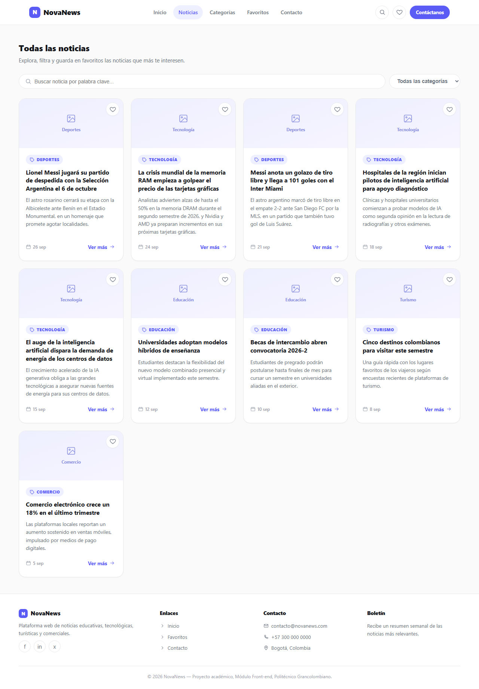
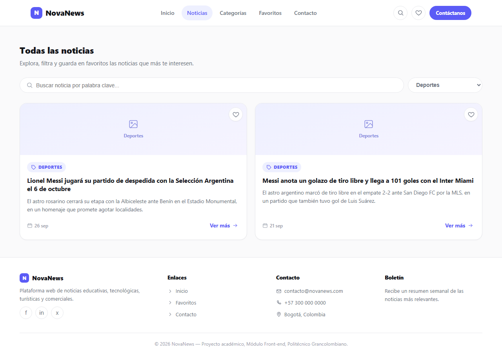
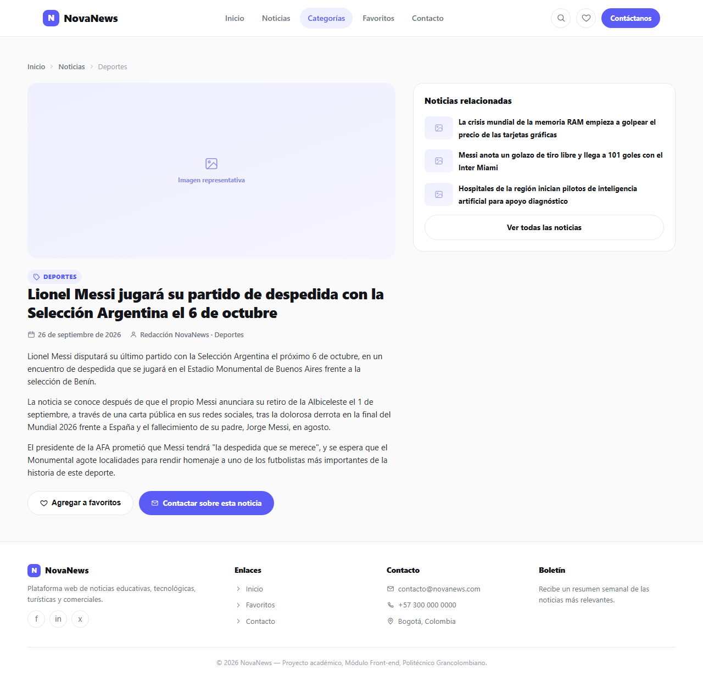
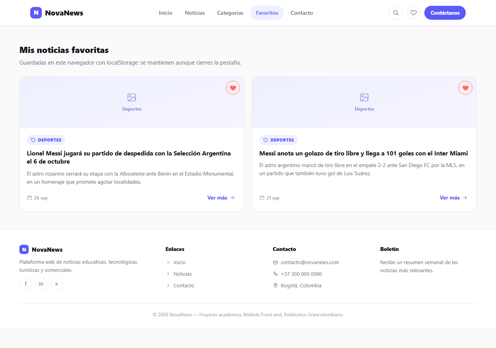
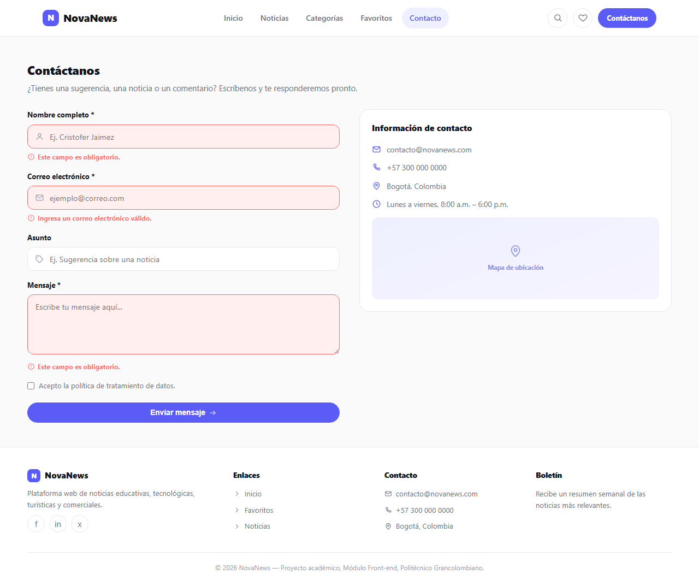

# NovaNews


Portal de noticias desarrollado como proyecto del módulo **Front End** (Primer Bloque-Virtual – Front End B02) de la **Institución Universitaria Politécnico Grancolombiano**.

El sitio principal está construido con **HTML, CSS y JavaScript puro** (sin frameworks ni librerías externas), con renderizado dinámico de contenido desde JSON, sistema de favoritos persistente y validación de formularios. Para la entrega final se incorporó además una **demo de componentes Angular** (binding y standalone components) que reproduce el listado de noticias y la gestión de favoritos.

## 🌐 Demo en vivo

| | |
|---|---|
| **Sitio principal** | [https://cristoferjaimez.github.io/front-end-politecnico/](https://cristoferjaimez.github.io/front-end-politecnico/index.html) |
| **Demo de componentes Angular** | [https://cristoferjaimez.github.io/front-end-politecnico/pages/angular-demo/](https://cristoferjaimez.github.io/front-end-politecnico/pages/angular-demo/) |

## Instalación y ejecución

### 1. Clonar el repositorio

```bash
git clone https://github.com/cristoferJaimez/front-end-politecnico.git
cd front-end-politecnico
```

### 2. Levantar un servidor local

Por restricciones del navegador con `fetch()` bajo el protocolo `file://`, se recomienda servir el sitio con un servidor local en lugar de abrir los archivos `.html` directamente con doble clic.

Con Python instalado:

```bash
python -m http.server 5500
```

O con la extensión **Live Server** de VS Code (clic derecho sobre `index.html` → *Open with Live Server*).

### 3. Abrir en el navegador

```
http://localhost:5500
```

> Si abres los archivos directamente con doble clic, el sitio también funciona gracias a un contenido de respaldo embebido en JavaScript, pero **los favoritos no se comparten correctamente entre páginas bajo `file://`**. Usar el servidor local evita ese problema y es además el mismo comportamiento que tendrá el sitio una vez publicado (por ejemplo, en GitHub Pages).

## Funcionalidades

- **Inicio**: noticias destacadas cargadas dinámicamente desde `data/noticias.json`.
- **Listado de noticias**: buscador en vivo por texto y filtro por categoría.
- **Detalle de noticia**: página dinámica por `id` (`detalle.html?id=...`), con noticias relacionadas.
- **Favoritos**: marcar/desmarcar noticias como favoritas, persistidas en `localStorage` y visibles en una página dedicada.
- **Contacto**: formulario con validación de campos (nombre, correo con formato válido, mensaje) y mensajes de error/éxito.
- **Demo Angular**: versión del listado de noticias y favoritos construida con componentes de Angular (property binding, event binding y two-way binding), accesible desde el menú de navegación ("Demo Angular").
- Diseño responsivo, estilo minimalista tipo SaaS (paleta índigo, botones tipo pill, navegación con iconos).

## Capturas de pantalla

**Inicio**


**Listado de noticias**


**Listado filtrado por categoría**


**Detalle de noticia**


**Favoritos**


**Contacto con validación**


## Estructura del proyecto

```
front-end-politecnico/
├── index.html                   # Página de inicio (HTML/CSS/JS)
├── css/
│   └── styles.css               # Estilos globales del sitio
├── js/
│   ├── data.js                   # Carga de datos (fetch + fallback embebido)
│   └── main.js                    # Lógica de renderizado, favoritos, filtros y validación
├── data/
│   └── noticias.json             # Fuente de datos de las noticias
├── capturas/                     # Screenshots del prototipo funcionando
├── pages/
│   ├── listado.html               # Listado con buscador y filtro por categoría
│   ├── detalle.html                # Detalle dinámico de una noticia
│   ├── favoritos.html               # Noticias marcadas como favoritas
│   ├── contacto.html                 # Formulario de contacto con validación
│   └── angular-demo/                 # Build ya compilado de la demo Angular (servido tal cual)
│       ├── index.html
│       ├── main-*.js
│       ├── polyfills-*.js
│       ├── styles-*.css
│       └── noticias.json
└── angular-noticias/              # Código fuente del proyecto Angular (no se despliega directo)
    └── src/app/
        ├── app.component.ts/html/css
        ├── components/
        │   ├── noticia-card/            # @Input / @Output (property & event binding)
        │   └── listado-noticias/        # *ngFor, [(ngModel)] (two-way binding)
        └── services/
            ├── noticias.service.ts       # HttpClient → noticias.json
            └── favoritos.service.ts      # Persistencia en localStorage
```

> La carpeta `pages/angular-demo/` contiene el resultado de `ng build --base-href "./"` ejecutado dentro de `angular-noticias/`; es la que efectivamente sirve GitHub Pages. Si modificas el código fuente en `angular-noticias/src`, debes volver a compilar y copiar el contenido de `angular-noticias/dist/angular-noticias/browser/` a `pages/angular-demo/`.

## Tecnologías

- HTML5 semántico
- CSS3 (variables, Flexbox, Grid)
- JavaScript (ES6+), sin frameworks
- Angular 19 (standalone components) para la demo de componentes y binding
- `localStorage` para persistencia de favoritos
- Iconos SVG inline
- Git y GitHub Pages para control de versiones y despliegue

## Equipo — Conjunto 15

- Cristofer Ramón Jaimez López
- Miguel Angel Agudelo Ospina
- Brayan Briceño Rojas

**Curso:** Primer Bloque-Virtual – Front End B02
**Docente:** John Olarte Ramos
**Institución:** Institución Universitaria Politécnico Grancolombiano

## Repositorio

[https://github.com/cristoferJaimez/front-end-politecnico.git](https://github.com/cristoferJaimez/front-end-politecnico.git)

## Despliegue

- **Sitio principal:** [https://cristoferjaimez.github.io/front-end-politecnico/index.html](https://cristoferjaimez.github.io/front-end-politecnico/index.html)
- **Demo Angular:** [https://cristoferjaimez.github.io/front-end-politecnico/pages/angular-demo/](https://cristoferjaimez.github.io/front-end-politecnico/pages/angular-demo/)

Publicado con **GitHub Pages**, desde la rama `main`, carpeta raíz (`/`).
